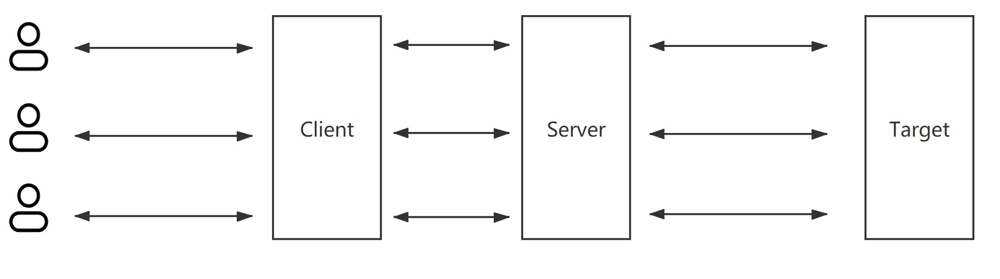
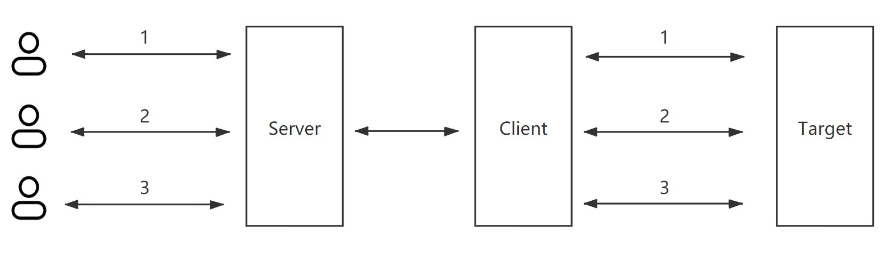

### LCX-内网穿透

#### 背景

​	由于NAT设备的存在，使得外网无法直接访问内网IP，因此需要内网穿透技术，通过一台外网的服务器以及内网的客户端，就可以实现对内网内容的访问。

#### 相关内容

- 代理

  

  ​	如图所示，对于代理来说，用户位于客户端侧，如果有新的用户，只要向服务端发起新的连接请求，服务端将收到的新的连接与目标之间建立双向的管道即可。客户端也是同理，将用户的sock与新建立的连接建立双向管道。

  ```javascript
  // client
  
  userSock.pipe(serverConnection)
  serverConnection.pipe(userSock);
  
  
  // server
  
  clientSock.pipe(targetSock);
  targetSock.pipe(clientSock);
  ```

  ​	这样就完成了最简单的代理功能。

  可以拓展的功能有：

  - 可以在客户端与服务端之间添加认证的机制
  - 可以在客户端与服务端之间加密传输

- 内网穿透

  

  ​	与代理不同，由于用户位于Server侧，但是建立连接只能由Client主动向Server发起，因为NAT等设备使得Server无法直接连接Client，Server与Client之间的通信只能通过Client主动建立的socket来进行。（是否可以通过socket获取到真实的ip+端口，然后server主动向client建立连接，NAT是将某个IP+端口分配给某一内网主机，有些NAT可能会阻止来自外部主动建立的连接）。

  ​	因此，用户与目标之间的多路通信必须通过一条由client到server的连接来完成。

#### 难点

- 传输时需要区分不同用户的数据
- 当目标socket关闭后，需要通知对应的用户socket也关闭，避免占用过多内存
- 因为有不同的用户会通过一个连接进行数据传输，因此需要自定义数据包格式

#### 遇到的问题

- 使用lcx下载大文件出错
  - 这是因为数据包的长度加上自定义的包头之后超出了socket预先设置的缓冲区大小。
  - 解析数据包时需要判断当前收到的buffer长度与解析得到的数据包长度之间的关系，如果数据包长度大于当前buffer，需要将当前buffer缓存，等待下一次收到数据之后再处理。
- 在进行编码包传输之前，先使用建立的socket进行简单的通信，传输服务端要监听的端口，之后再传输编码过的包，发现无法传输。
  - 这是因为给通信的socket添加了不同的处理函数。
  - 使用自定义的包头来区分不同类型的通信。（简单的定义协议）
- socket的error事件与close事件重复触发
  - close事件会在error之后触发，因此需要考虑处理函数的重复执行问题，需要增加判断。
  - 但是不可以只监听close事件，因为这样error会抛出导致程序终止。
- 客户端关闭后，服务端如何解除原来监听端口的占用，使得后续的连接可以使用？
  - 主动释放空间，调用server.close和server.unref
- 服务端故障之后，客户端定时尝试重新连接
  - 在故障之后，客户端启动定时任务

#### 待完善功能

- 连接测速功能

